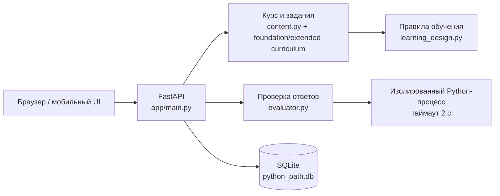

# Архитектура Python Path

## Компоненты

### Frontend

`app/static/` — мобильный single-page интерфейс без сборочного шага. `app.js` получает уроки и прогресс через JSON API, а `styles.css` содержит desktop- и mobile-layout.

### API

`app/main.py` отдаёт интерфейс и реализует маршруты курса, уроков, практики, экзаменов, проектов и проверки кода. `GET /api/practice/session` берёт только завершённые уроки, ранжирует вопросы по ошибкам, сроку интервального повторения и числу попыток, затем чередует форматы. Приложение намеренно single-user: регистрация и авторизация пока не нужны для личного тренажёра.

### Контент

`gentle_start.py` задаёт 19 исходных коротких уроков, `content.py` — базовый маршрут, а `foundation_expansion.py` заменяет пять перегруженных тем, вставляет девять микроуроков и добавляет 24 накопительных задания. В результате до расширенной части идёт 43 постепенных урока. `extended_curriculum.py` добавляет ещё 108 уроков с четырьмя формами работы: выбор, свободное воспроизведение, Parsons и накопительный код.

`learning_design.py` добавляет `concepts`, `prerequisites`, `practices`, сложность и интервалы 1/3/7/14/30 каждому уроку и заданию. Его curriculum-linter проходит по Python AST теории, вариантам, заготовкам, подсказкам и скрытым тестам и останавливает CI, если инструмент появился раньше объяснения. Нормативные правила описаны в `docs/LEARNING_DESIGN.md`.

### Прогресс

SQLite хранит XP, стрик, результаты уроков, экзаменов и историю попыток. `db.py` считает число попыток, последнюю дату и серию верных ответов. Ошибка остаётся слабым местом, пока ученик не решит задание верно два раза подряд. API определяет доступность следующего урока по предыдущему завершённому. Личная база `python_path.db` остаётся локальной; `tests/conftest.py` подменяет её временной SQLite-базой, поэтому тесты не могут очистить учебный прогресс.

Таблица `project_progress` хранит завершённые мини-проекты. Проект открывается после конкретных prerequisite lesson ID и предыдущего проекта. Итоговая проверка повторно запускает решение на нескольких сценариях, поэтому вывод, захардкоженный под демонстрационный ввод, отклоняется.

### Проверка кода

Все учебные задания, проекты и свободная песочница запускают код через один дочерний раннер. Он поддерживает `input()` с заранее переданными строками, функции, классы, безопасные dunder-методы, async, разрешённые части стандартной библиотеки и перехват консольного вывода. `open()` и `pathlib.Path` работают внутри отдельной временной виртуальной папки, которая исчезает после запуска.

Перед запуском `evaluator.py` разбирает AST, разрешает только allowlist импортов и отклоняет системные, процессные, произвольные сетевые операции и служебные атрибуты. Затем краткое решение выполняется в изолированном интерпретаторе с ограниченным набором builtin-функций и таймаутом. Parsons проверяется по порядку блоков, а явно заявленные синтаксические цели — узкими AST-тестами. Это защита для локального обучения, не публичная многоарендная песочница.

## Расширение

Чтобы добавить урок, достаточно дополнить каталог: урок автоматически попадёт в маршрут, API, практику и проверку целостности программы. Для нового типа задания нужно расширить `evaluate()` и шаблон отображения вопроса в `app/static/app.js`.
