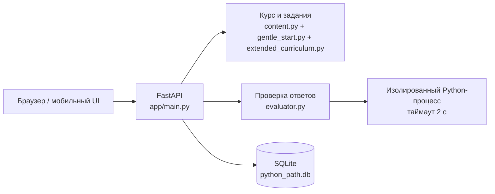

# Архитектура Python Path

## Компоненты

### Frontend

`app/static/` — мобильный single-page интерфейс без сборочного шага. `app.js` получает уроки и прогресс через JSON API, а `styles.css` содержит desktop- и mobile-layout.

### API

`app/main.py` отдаёт интерфейс и реализует маршруты курса, уроков, практики, экзаменов, проверки кода и сброса прогресса. `GET /api/practice/session` собирает короткую серию из уже открытого материала: текущая тема, ошибки, смешанное повторение или выбранный раздел. Приложение намеренно single-user: регистрация и авторизация пока не нужны для личного тренажёра.

### Контент

`gentle_start.py` добавляет 19 очень коротких уроков перед основным маршрутом: одна идея, разбор примера и безопасная практика. `content.py` содержит базовые 12 уроков, а `extended_curriculum.py` добавляет ещё 108 через структурированный каталог. Перед практикой `content.py` добавляет каждому уроку опору и план решения каждой задачи.

### Прогресс

SQLite хранит XP, стрик, результаты уроков, экзаменов и историю попыток. `db.py` рассчитывает, какие задания нужно повторить, а API определяет доступность следующего урока по предыдущему завершённому.

### Проверка кода

Перед запуском `evaluator.py` разбирает AST и отклоняет импорты, доступ к служебным атрибутам и системные функции. Затем краткое решение выполняется в дочернем интерпретаторе с ограниченным набором builtin-функций и таймаутом. Это защита для локального обучения, не публичная песочница.

## Расширение

Чтобы добавить урок, достаточно дополнить каталог: урок автоматически попадёт в маршрут, API, практику и проверку целостности программы. Для нового типа задания нужно расширить `evaluate()` и шаблон отображения вопроса в `app/static/app.js`.
