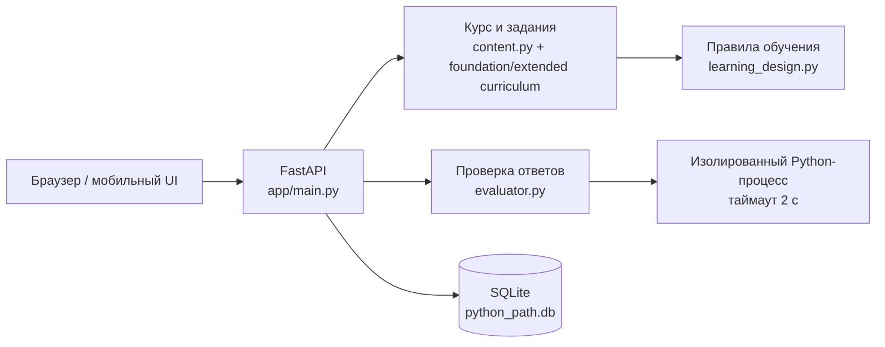

# Архитектура Python Path

## Компоненты

### Frontend

`app/static/` — мобильный single-page интерфейс без сборочного шага. `app.js` получает уроки и прогресс через JSON API, а `styles.css` содержит desktop- и mobile-layout.

### API

`app/main.py` отдаёт интерфейс и реализует маршруты курса, уроков, практики, экзаменов, проектов и проверки кода. `GET /api/practice/session` берёт только завершённые уроки, ранжирует вопросы по ошибкам, сроку интервального повторения и числу попыток, затем чередует форматы. Сервер повторно проверяет доступность question ID на submit/run/check, поэтому прямой запрос не позволяет перепрыгнуть в будущую тему или получить XP. На границе раздела dashboard явно возвращает следующий обязательный экзамен; только раздел со сданным экзаменом автоматически сворачивается. Приложение намеренно single-user: регистрация и авторизация пока не нужны для личного тренажёра.

### Контент

`gentle_start.py` задаёт 19 исходных коротких уроков, `content.py` — базовый маршрут, а `foundation_expansion.py` заменяет пять перегруженных тем, вставляет девять микроуроков и добавляет 24 накопительных задания. В результате до расширенной части идёт 43 постепенных урока. `extended_curriculum.py` описывает ещё 108 уроков с четырьмя формами работы: выбор, свободное воспроизведение, Parsons и код. Каждому продвинутому уроку `advanced_practice.py` даёт свою тематическую задачу, эталонное решение для CI и не менее двух поведенческих проверок.

`learning_design.py` добавляет `concepts`, `prerequisites`, `practices`, сложность и интервалы 1/3/7/14/30 каждому уроку и заданию. Там же находится канонический `TOOL_CATALOG`: накопительные задания и проекты явно ссылаются на нужные уже пройденные инструменты, а для тематического кода набор карточек дополнительно сверяется с вызовами в скрытом эталонном решении. API отдаёт только безопасные поля справочной карточки. Curriculum-linter проходит по Python AST теории, вариантам, заготовкам, справочным примерам, подсказкам, эталонным решениям и скрытым тестам и останавливает CI, если инструмент появился раньше объяснения или остался без справочной карточки. Нормативные правила описаны в `docs/LEARNING_DESIGN.md`.

### Прогресс

SQLite хранит XP, стрик, результаты уроков, экзаменов и историю попыток. У попытки есть `hints_used`: верный ответ после подсказки закрепляет материал, но не увеличивает серию самостоятельных ответов. Ошибка или помощь оставляет задание слабым местом до двух верных самостоятельных повторений. Внутри раздела уроки открываются последовательно; переход к новому разделу дополнительно требует сданный экзамен. Миграции добавляют новые поля без пересоздания таблиц. Личная база `python_path.db` остаётся локальной; `tests/conftest.py` подменяет её временной SQLite-базой.

Таблица `project_progress` хранит завершённые мини-проекты. Проект открывается после конкретных prerequisite lesson ID и предыдущего проекта. Итоговая проверка повторно запускает решение на нескольких сценариях, поэтому вывод, захардкоженный под демонстрационный ввод, отклоняется. У каждого проекта есть скрытое от API `reference_solution`; CI исполняет его на основной проверке и каждом сценарии, чтобы не допустить нерешаемого задания.

### Проверка кода

Все учебные задания, проекты и свободная песочница запускают код через один дочерний раннер. Он поддерживает `input()` с заранее переданными строками, функции, классы, async, `argparse`, SQLite, очереди и ограниченные потоки. `open()`, `pathlib.Path` и файлы SQLite работают внутри отдельной временной виртуальной папки, которая исчезает после запуска. Поведенческие проверки в обычном случае требуют точный вывод; для задач с приглашением `input()` автор может явно выбрать сравнение по смысловому фрагменту.

Перед отдачей API удаляет из задания ответ, эталонное решение, тесты, контрольные входы и внутренние tool ID. Из результата проверки браузер получает только статус каждого сценария, понятное направление и собственный stdout, но не пары `expected`/`actual` скрытых тестов. Справочные карточки отдаются только кодовым заданиям: в вопросе на узнавание они могли бы сразу раскрыть ответ.

Экзамены используют отдельные assessment-ID, убирают обучающие комментарии из кодового каркаса и не могут засчитать сохранённый ответ урока. Каждое из 118 кодовых assessment-заданий получает дополнительный поведенческий сценарий, которого не было в уроке; проверки текста и AST из учебной карточки туда не переносятся, поэтому эквивалентное работающее решение принимается. Порядок заданий и варианты выбора перемешиваются при каждой выдаче; обязательный код и порог 70% сохраняются.

Перед запуском `evaluator.py` разбирает AST, разрешает только allowlist импортов и отклоняет системные, процессные, произвольные сетевые операции и служебные атрибуты. Затем краткое решение выполняется в изолированном интерпретаторе с ограниченным набором builtin-функций и таймаутом. Parsons проверяется по порядку блоков, а явно заявленные синтаксические цели — узкими AST-тестами. Это защита для локального обучения, не публичная многоарендная песочница.

## Расширение

Чтобы добавить урок, достаточно дополнить каталог: урок автоматически попадёт в маршрут, API, практику и проверку целостности программы. Для нового типа задания нужно расширить `evaluate()` и шаблон отображения вопроса в `app/static/app.js`.
